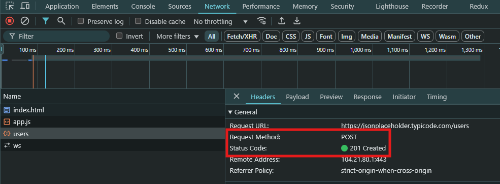
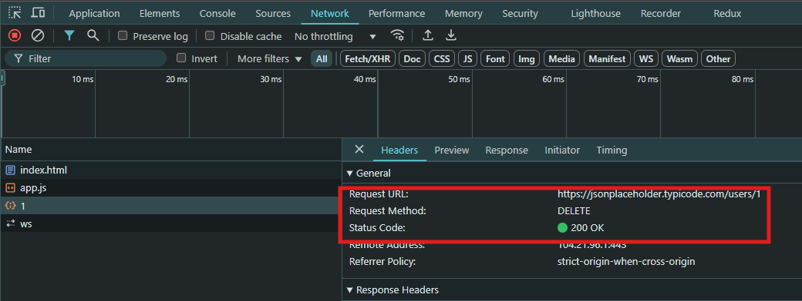
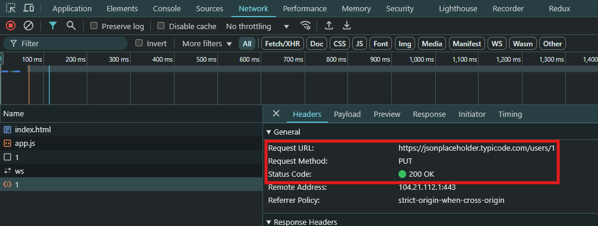

## fetch API

```bash
https://jsonplaceholder.typicode.com/users
```

### Get all users

Fetch all users using fetch API with then...catch

```js
const getAllUsers = () => {
  fetch(BASE_URL)
    .then((data) => data.json())
    .then((user) => console.log(user));
};
getAllUsers();
```

Fetch all users using fetch API with async/await

```js
const fetchUsers = async () => {
  const users = await fetch(BASE_URL);
  const jsonUsers = await users.json();
  console.log(await jsonUsers);
};
fetchUsers();
```

### Get one user

Fetch one user using fetch API then...catch

```js
const getOneUser = (userId) => {
  fetch(`${BASE_URL}/${userId}`)
    .then((data) => data.json())
    .then((data) => console.log(data));
};
getOneUser(1);
```

Fetch one user using fetch API with async/await

```js
const getOneUser = async (userId) => {
  const user = await fetch(`${BASE_URL}/${userId}`);
  const jsonData = await user.json();
  console.log(await jsonData);
};
getOneUser(1);
```

### Add new user

Add new user using fetch API then...catch

```js
const addNewUser = (user) => {
  fetch(BASE_URL, {
    method: "POST",
    body: JSON.stringify(user),
  })
    .then((data) => data.json())
    .then((data) => console.log(data));
};
addNewUser({
  name: "Lyna",
  username: "lyna_sovann",
  email: "sovannlyna2004@gmail.com",
  address: {},
  phone: "0123456789",
  website: "myblog.fake.website",
  company: {},
});
```

Add new user using fetch API with async/await

```js
const addNewUser = async (body) => {
  const res = await fetch(BASE_URL, {
    method: "POST",
    body: JSON.stringify(body),
  });
  const user = await res.json();
  console.log(await user);
};
addNewUser({
  name: "Lyna",
  username: "lyna_sovann",
  email: "sovannlyna2004@gmail.com",
  address: {},
  phone: "0123456789",
  website: "myblog.fake.website",
  company: {},
});
```

### Result



### Delete new user

Delete user by id using fetch API then...catch

```js
const deleteUser = (userId) => {
  fetch(`${BASE_URL}/${userId}`, {
    method: "DELETE",
  })
    .then((res) => res.json())
    .then((res) => console.log(res));
};
deleteUser(1);
```

Delete user using fetch API with async/await

```js
const deleteUser = async (userId) => {
  const res = await fetch(`${BASE_URL}/${userId}`, {
    method: "DELETE",
  });
  const jsonRes = await res.json();
  console.log(await jsonRes);
};
deleteUser(1);
```

### Result



## Update user Info

Update user using fetch API then...catch

```js
const updateUser = (userId, body) => {
  fetch(`${BASE_URL}/${userId}`, {
    method: "PUT",
    body: JSON.stringify(body),
  })
    .then((data) => data.json())
    .then((res) => console.log(res));
};
updateUser(1, {
  name: "Lyna",
  username: "lyna_sovann",
  email: "sovannlyna2004@gmail.com",
  address: {},
  phone: "0123456789",
  website: "myblog.fake.website",
  company: {},
});
```

Update user using fetch API with async/await

```js
const updateUser = async (userId, body) => {
  const res = await fetch(`${BASE_URL}/${userId}`, {
    method: "PUT",
    body: JSON.stringify(body),
  });
  const jsonRes = await res.json();
  console.log(await jsonRes);
};
updateUser(1, {
  name: "Lyna",
  username: "lyna_sovann",
  email: "sovannlyna2004@gmail.com",
  address: {},
  phone: "0123456789",
  website: "myblog.fake.website",
  company: {},
});
```

### Result



## XML HttpRequest
